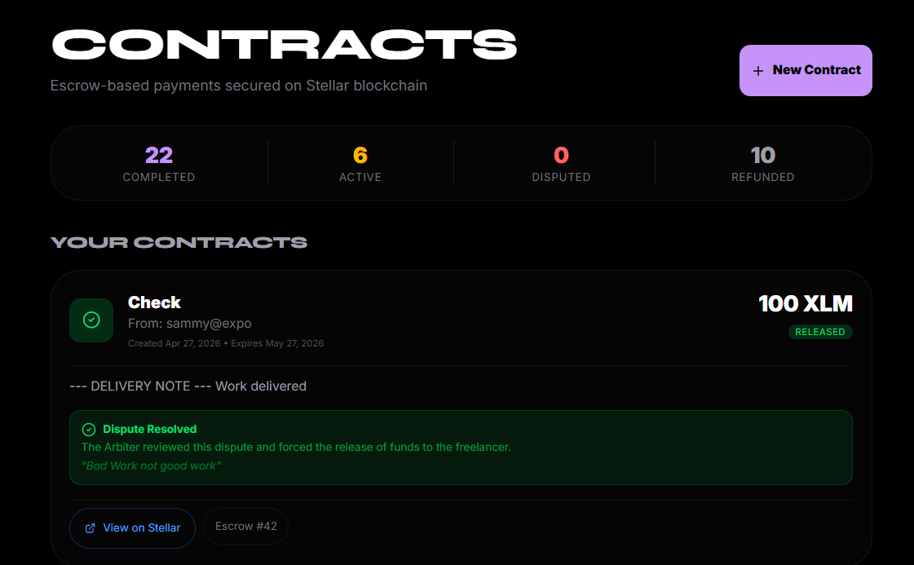
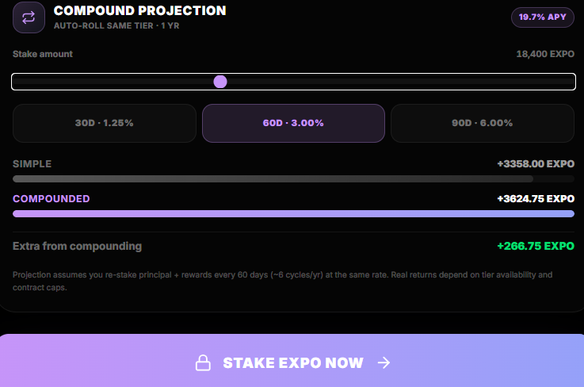
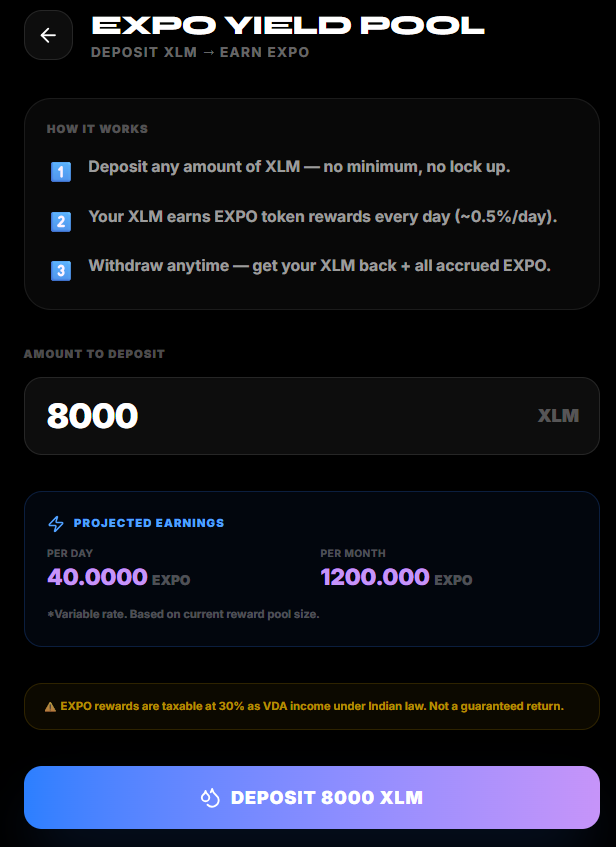

<div align="center">


# ExpoPay — Global Payment Router

**Cross-border payments, escrow, group bills, and on-chain savings — all on Stellar.**

ExpoPay turns wallet addresses into human-readable Universal IDs (`alice@expo`), settles payments in seconds via Stellar, lets Indian merchants receive INR via UPI, lets freelancers and clients lock milestone funds in a Soroban contract, splits group bills automatically, and provides an on-chain Vault for EXPO staking and daily XLM yield.

[**Live demo →**](https://exporouter.site) &nbsp;·&nbsp; 

</div>

---

## Table of Contents

1. [Highlights](#highlights)
2. [Feature tour with screenshots](#feature-tour)
3. [Architecture](#architecture)
4. [Smart contracts](#smart-contracts-soroban)
5. [API reference](#api-reference)
6. [Database schema](#database-schema)
7. [Environment variables](#environment-variables)
8. [Getting started](#getting-started)
9. [Project structure](#project-structure)
10. [Security notes](#security-notes)
11. [Roadmap](#roadmap)

---

## Highlights

- **Universal IDs** — send to `alice@expo` instead of a 56-char Stellar public key.
- **Instant P2P** — XLM/USDC/INR P2P transfers settled on Stellar in ~3 seconds.
- **Escrow with arbiter** — Soroban contract handles fund/deliver/release/dispute/resolve. Two-step arbiter override pays the freelancer even when the on-chain `release` is locked.
- **Split bills** — equal or custom-share bill splitting across `@expo` users, with per-participant payment tracking and notifications.
- **On-chain Vault** — fixed-term EXPO staking (30/60/90 days, up to 6%) plus a no-lock XLM yield pool that mints EXPO rewards daily. Live accrual UI, compound projection, and a real-time earnings ticker.
- **Indian UPI bridge** — pay any UPI QR with crypto; merchant receives INR.
- **Cross-currency FX** — XLM ↔ USDC ↔ INR/USD/EUR/GBP with locked-window quotes.
- **Inactivity guard, transaction PINs, on-chain audit trail** — every action emits a Stellar tx hash you can verify on Stellar Expert.

---

## Feature tour

### 1 · Dashboard overview

The home of the app — wallet balance, recent transactions, quick actions for Send/Scan/Split/Vault.


### 2 · Pay Indian merchants with crypto

Scan any UPI QR or pick a demo merchant. The platform converts XLM/USDC to INR at a locked rate and settles UPI to the merchant.


### 3 · P2P send

Send to `bob@expo` instead of `GAB6F…`. Cross-currency sends show a live FX quote with a locked window.


### 4 · Transaction history

Every payment, escrow action, split contribution, and vault event in one place — each row links to Stellar Expert for on-chain verification.


### 5 · Soroban escrow contracts

Lock funds in a Soroban contract, mark delivered, release on completion. If something goes wrong, either party can dispute and an arbiter resolves it on-chain.



### 6 · Split bills *(new)*

Create a bill, pick `@expo` participants, choose **Equal** or **Custom shares**, and the app tracks who's paid and who hasn't. Each participant pays from their own balance with a single tap; the creator gets paid out directly.


What's under the hood:

- `split_bills` + `split_participants` tables track totals and per-user shares
- Each pay-in is an on-chain Stellar payment from participant → creator
- Status transitions: `active` → `partial` → `paid` (auto when all participants settle)

### 7 · Vault — staking + yield pool *(new)*

Two products in one tab. Live earnings ticker, animated stake progress, and a built-in compound-interest projection.

#### Staking

Lock EXPO for 30, 60, or 90 days for **1.25% / 3.00% / 6.00%** flat reward (≈15 / 18 / 24% APR). Each active stake card shows current value, time remaining, accrued reward (animated 1 Hz), and unlocks at maturity.


#### Compound projection (innovation)

Drag the slider for amount, tap a tier — see what auto-rolling that tier yields vs simple interest over a year, with the true APY computed via discrete compounding `P × (1+r)^n − P`.



#### XLM Yield Pool

Deposit XLM with **no lock-up**, earn EXPO at 0.5% per XLM per day (~18% APR). Withdraw anytime; rewards accrue linearly and are paid out in EXPO from the pool's reward bucket on withdrawal.



### 8 · CI / CD

Every push runs the `ci.yml` workflow: typecheck, lint, build, contract test suite.


---

## Architecture

```
┌─────────────────────┐         ┌──────────────────────┐
│   Next.js 15 App    │ ──────▶ │  /api/* Route        │
│   (App Router,      │         │   Handlers           │
│    Framer Motion,   │         │   (server-only)      │
│    Tailwind 4)      │         └──────────┬───────────┘
└─────────────────────┘                    │
       ▲                                   │
       │                          ┌────────┼────────┐
       │                          ▼        ▼        ▼
       │                    ┌──────────┐ ┌──────┐ ┌────────────┐
       │                    │ Supabase │ │  FX  │ │  Stellar   │
       │                    │ (PG +    │ │ rates│ │   SDK +    │
       │                    │  Auth +  │ └──────┘ │  Soroban   │
       │                    │ Realtime)│          │  contracts │
       │                    └──────────┘          └─────┬──────┘
       │                                                │
       │                                                ▼
       │                                       ┌──────────────────┐
       │  Realtime channel (Supabase) ◀──────  │  Stellar Testnet │
       │  for live transaction & split status  │  (Soroban + base │
       │                                       │   asset network) │
       └───────────────────────────────────────┴──────────────────┘
```

---

## Smart contracts (Soroban)

Three contracts are deployed and used in production:

### Escrow — `contracts/escrow/src/lib.rs`

| Function | Description | Inter-contract call |
|---|---|---|
| `create` | Create an escrow with EXPO `token_id` | — |
| `fund` | Client locks EXPO tokens in escrow | ✅ Client → Escrow |
| `deliver` | Freelancer marks work as delivered | — |
| `release` | Client releases EXPO to freelancer | ✅ Escrow → Freelancer |
| `refund` | Cancel and refund EXPO to client | ✅ Escrow → Client |
| `dispute` | Either party raises a dispute | — |
| `resolve` | Arbiter distributes EXPO to winner *(superseded — see note below)* | ✅ Escrow → Winner |
| `get` | Query escrow state | — |

**Arbiter resolution note.** The current testnet build is a pre-`resolve` revision. Arbiter outcomes are handled in the API by:
- *Refund client* → `refund(escrow_id)` signed by the payer.
- *Pay freelancer* → `refund(escrow_id)` then a SEP-41 `transfer` from the payer's wallet to the freelancer's, both signed custodially. Net result equals a single resolve-to-freelancer call.

### Staking — `contracts/staking/src/lib.rs`

| Function | Description |
|---|---|
| `init` | Set the EXPO token address and admin (one-time) |
| `stake` | Lock EXPO for 30/60/90 days, returns `stake_id` |
| `unstake` | Burn the stake position, payout = principal + reward |
| `get_stake` | Query a single stake by id |
| `get_pool_balance` | View remaining reward pool |
| `fund_pool` | Admin tops up the reward pool |

Reward math: linear, flat-rate `reward = amount × bps / 10000` over the lock duration. Stake states: `active → claimed`. Reward bps by tier: 30d → 125, 60d → 300, 90d → 600.

### XLM Yield Pool — `contracts/pool/src/lib.rs`

| Function | Description |
|---|---|
| `init` | Set EXPO reward token + admin |
| `deposit` | Lock XLM, returns `position_id` |
| `withdraw` | Return principal + EXPO accrued |
| `get_position` | Query a deposit |
| `fund_rewards` | Admin tops up the EXPO reward bucket |

Reward math: linear time-based accrual `accrued_expo = xlm_amount × BASE_REWARD_BPS_PER_DAY × elapsed_days / 10000` with `BASE_REWARD_BPS_PER_DAY = 50` (≈18% APR).

### Deployed contract IDs (Stellar Testnet)

| Contract | Address |
|---|---|
| Escrow | `CAGMD6PBDSOSB2NDOE5ZGYCWH74EOBJFHM627WTGLZZF66DBRUFWYSPT` |
| EXPO Token | `CDLZFC3SYJYDZT7K67VZ75HPJVIEUVNIXF47ZG2FB2RMQQVU2HHGCYSC` |
| Staking & Pool | Set via `STAKING_CONTRACT_ID` / `POOL_CONTRACT_ID` env vars |

### Inter-contract call proof

- **Tx Hash:** `d62faff341a803b549c7c244acb0e1fd502823ee4f9ce815c51cd9eebd473f76`
- **Explorer:** [View on Stellar Expert](https://stellar.expert/explorer/testnet/tx/d62faff341a803b549c7c244acb0e1fd502823ee4f9ce815c51cd9eebd473f76)
- **Ledger:** `667150` · **Type:** `invoke_host_function` (escrow `create` calling EXPO token `transfer`)

---

## API reference

### Auth
All routes use Supabase session cookies (`getUser()` server-side). Routes that move funds require the user to have set their 4-digit transaction PIN.

### Payments
| Method | Endpoint | Description |
|---|---|---|
| POST | `/api/payments/send` | Send P2P payment by Universal ID |
| GET | `/api/payments/history` | User's transaction history |

### Universal ID & wallet
| Method | Endpoint | Description |
|---|---|---|
| GET | `/api/expo/profile` | Get user profile |
| GET | `/api/expo/balance` | Wallet balances (XLM, EXPO, …) |
| GET | `/api/expo/resolve?username=…` | Resolve `@expo` ID to a Stellar address |
| POST | `/api/expo/claim` | Claim a Universal ID and create wallet |
| GET | `/api/expo/check` / `check-phone` | Availability checks |
| POST | `/api/expo/pin` | Set or change the 4-digit PIN |

### Escrow contracts
| Method | Endpoint | Description |
|---|---|---|
| GET / POST | `/api/contracts` | List / create escrow |
| POST | `/api/contracts/fund` | Fund an escrow |
| POST | `/api/contracts/deliver` | Mark as delivered |
| POST | `/api/contracts/release` | Release funds (payer) |
| POST | `/api/contracts/dispute` | Raise dispute (either party) |
| POST | `/api/contracts/refund` | Refund (payer) or auto-claim (freelancer after 7d) |
| GET | `/api/admin/contracts` | List escalated disputes (arbiter only) |
| POST | `/api/admin/resolve` | Force-resolve a dispute (arbiter only) |

### Split bills *(new)*
| Method | Endpoint | Description |
|---|---|---|
| GET / POST | `/api/split` | List / create a split bill |
| GET | `/api/split/[id]` | Detail, including participants and statuses |
| POST | `/api/split/[id]/pay` | Settle current user's share |

### Vault — staking & pool *(new)*
| Method | Endpoint | Description |
|---|---|---|
| GET | `/api/savings/positions` | All stakes + pool positions, with live current-value, accrued rewards, time remaining, summary aggregates |
| POST | `/api/savings/stake` | Stake EXPO for 30/60/90 days |
| POST | `/api/savings/unstake` | Unstake matured position; pays principal + reward |
| POST | `/api/savings/pool/deposit` | Deposit XLM into the yield pool |
| POST | `/api/savings/pool/withdraw` | Withdraw XLM principal + accrued EXPO |

### Merchant (UPI bridge)
| Method | Endpoint | Description |
|---|---|---|
| POST | `/api/merchant/quote` | Get XLM↔INR quote |
| POST | `/api/merchant/pay` | Process merchant payment + simulate UPI settlement |
| GET | `/api/merchant/history` | Merchant payment history |

### FX
| Method | Endpoint | Description |
|---|---|---|
| GET | `/api/fx/quote` | Live FX rate between any supported pair |

---

## Database schema

Three migration files live at the repo root:
- `supabase_migration.sql` — core tables (profiles, transactions, contracts, merchant_payments)
- `supabase_split_migration.sql` — `split_bills`, `split_participants`
- `supabase_savings_migration.sql` — `staking_positions`, `pool_positions`

### `profiles`
```
id, universal_id, stellar_address, stellar_secret, full_name,
phone, preferred_currency, app_pin, avatar_url, verified, created_at
```

### `transactions`
```
id, sender_id, recipient_id, sender_universal_id, recipient_universal_id,
amount, currency, tx_hash, status, note, purpose, created_at
```

### `contracts`
```
id, escrow_id, payer_id, freelancer_id, payer_universal_id,
freelancer_universal_id, amount, currency, title, description,
status, expiry_timestamp, disputed_by, dispute_after_delivery,
delivered_at, released_at, refunded_at,
tx_hash_create, tx_hash_release, tx_hash_refund, created_at
```

### `merchant_payments`
```
id, user_id, merchant_name, merchant_upi_id,
inr_amount, xlm_amount, rate, tx_hash, status, created_at
```

### `split_bills`  *(new)*
```
id, creator_id, creator_universal_id, title, description,
total_amount, currency, status (active|partial|paid|cancelled),
created_at
```

### `split_participants`  *(new)*
```
id, split_id, user_id, universal_id, share_amount,
paid_amount, status (pending|paid), tx_hash, paid_at
```

### `staking_positions`  *(new)*
```
id, user_id, universal_id, stake_id, amount_expo, duration_days,
reward_bps, reward_expo, status (active|completed),
tx_hash_stake, tx_hash_unstake, staked_at, unlocks_at, unstaked_at
```

### `pool_positions`  *(new)*
```
id, user_id, universal_id, position_id, amount_xlm, expo_earned,
status (active|withdrawn), tx_hash_deposit, tx_hash_withdraw,
deposited_at, withdrawn_at
```

---

## Environment variables

Create `.env` from `.env.example`:

```env
# Supabase
NEXT_PUBLIC_SUPABASE_URL=...
NEXT_PUBLIC_SUPABASE_ANON_KEY=...
SUPABASE_SERVICE_ROLE_KEY=...           # server-only — REQUIRED in production

# Stellar
SOROBAN_RPC_URL=https://soroban-testnet.stellar.org
STELLAR_NETWORK_PASSPHRASE=Test SDF Network ; September 2015
PLATFORM_SECRET_KEY=...                 # platform wallet for merchant settlement

# Soroban contract IDs (testnet)
ESCROW_CONTRACT_ID=CAGMD6PBDSOSB2NDOE5ZGYCWH74EOBJFHM627WTGLZZF66DBRUFWYSPT
TOKEN_CONTRACT_ID=CDLZFC3SYJYDZT7K67VZ75HPJVIEUVNIXF47ZG2FB2RMQQVU2HHGCYSC
STAKING_CONTRACT_ID=...                 # set after deploying contracts/staking
POOL_CONTRACT_ID=...                    # set after deploying contracts/pool

# Public mirrors (used in the browser)
NEXT_PUBLIC_ESCROW_CONTRACT_ID=CAGMD6PBDSOSB2NDOE5ZGYCWH74EOBJFHM627WTGLZZF66DBRUFWYSPT
NEXT_PUBLIC_TOKEN_CONTRACT_ID=CDLZFC3SYJYDZT7K67VZ75HPJVIEUVNIXF47ZG2FB2RMQQVU2HHGCYSC

# Email (optional, for notifications)
RESEND_API_KEY=...
NOTIFY_FROM_EMAIL="ExpoPay <noreply@yourdomain>"

# App
NEXT_PUBLIC_APP_URL=http://localhost:3000
```

> ⚠️ The server now refuses to start in `production` if `SUPABASE_SERVICE_ROLE_KEY` is missing — a deliberate guardrail so admin writes can't silently fall back to anon.

---

## Getting started

### Prerequisites
- Node.js 18+
- bun, npm, or pnpm
- Supabase project
- Stellar testnet account (auto-funded via Friendbot)
- Rust + `stellar-cli` *(only if you want to redeploy contracts)*

### Setup

```bash
# 1. Clone & install
git clone https://github.com/Div1912/ExpoPay.git
cd ExpoPay
bun install        # or: npm install

# 2. Configure env
cp .env.example .env
$EDITOR .env

# 3. Create the database schema
#    Apply, in order, in the Supabase SQL editor:
#      supabase_migration.sql
#      supabase_split_migration.sql
#      supabase_savings_migration.sql
#    Then enable Realtime on `transactions`, `contracts`, `split_bills`,
#    `staking_positions`, `pool_positions`.

# 4. Run dev server
bun run dev        # or: npm run dev
# → http://localhost:3000
```

### Building & deploying contracts (optional)

```bash
# Each contract directory has its own Cargo.toml
cd contracts/escrow
cargo build --target wasm32-unknown-unknown --release

stellar contract deploy \
  --wasm target/wasm32-unknown-unknown/release/escrow.wasm \
  --source-account YOUR_ACCOUNT \
  --network testnet
# → returns the contract ID; paste into ESCROW_CONTRACT_ID

# repeat for contracts/staking and contracts/pool, then call init() once
```

There's also `scripts/deploy.ts` for batch deployment and `scripts/fund-rewards.ts` for topping up the staking and pool reward buckets.

---

## Project structure

```
ExpoPay/
├── contracts/
│   ├── escrow/      # Soroban escrow contract
│   ├── staking/     # Fixed-term EXPO staking
│   └── pool/        # XLM deposit pool with EXPO rewards
├── scripts/
│   ├── deploy.ts        # Bulk-deploy all contracts
│   └── fund-rewards.ts  # Top up reward pools
├── src/
│   ├── app/
│   │   ├── api/
│   │   │   ├── admin/{contracts,resolve}/   # Arbiter actions
│   │   │   ├── contracts/{deliver,dispute,fund,refund,release}/
│   │   │   ├── expo/{balance,check,check-phone,claim,pin,profile,resolve}/
│   │   │   ├── fx/quote/
│   │   │   ├── merchant/{history,pay,quote}/
│   │   │   ├── payments/{history,send}/
│   │   │   ├── savings/{positions,stake,unstake,pool/{deposit,withdraw}}/
│   │   │   └── split/[id]/pay/
│   │   ├── auth/                     # Login, signup, OTP, reset
│   │   ├── dashboard/
│   │   │   ├── admin/                # Arbiter console
│   │   │   ├── contracts/            # Escrow UI
│   │   │   ├── history/              # Tx history
│   │   │   ├── merchant/             # Pay UPI
│   │   │   ├── savings/              # Vault: staking + pool
│   │   │   ├── scan/                 # QR scanner
│   │   │   ├── send/                 # Send P2P
│   │   │   ├── split/                # Split bills
│   │   │   ├── receive/              # Show your QR
│   │   │   ├── profile/  settings/
│   │   │   └── page.tsx              # Overview
│   │   ├── onboarding/
│   │   └── page.tsx                  # Landing
│   ├── components/
│   │   ├── InactivityGuard.tsx       # Auto-logout w/ visibility-aware timers
│   │   ├── Background.tsx  Logo.tsx  Navbar.tsx
│   │   ├── PaymentNotification.tsx   # Realtime in-app alerts
│   │   ├── sections/                 # Landing-page blocks
│   │   └── ui/                       # Reusable primitives (Radix-based)
│   ├── lib/
│   │   ├── stellar.ts                # Stellar SDK wrapper
│   │   ├── escrow.ts                 # Escrow + token transfer helpers
│   │   ├── savings.ts                # Staking & pool client
│   │   ├── fx-service.ts             # Live FX quotes
│   │   ├── upi-service.ts            # UPI QR parsing
│   │   ├── notify.ts                 # Resend email helpers
│   │   ├── supabase.ts               # Browser + admin clients
│   │   └── supabase-server.ts        # Server-side getUser()
│   └── middleware.ts                 # Auth gate for /dashboard/* and /auth/*
├── supabase_migration.sql
├── supabase_split_migration.sql      # NEW
├── supabase_savings_migration.sql    # NEW
└── screenshots/                      # README assets
```

---

## Security notes

What's already in place:
- Server-side `getUser()` on every API route; middleware also redirects unauthenticated browser navigations.
- 4-digit transaction PIN required for sends, merchant payments, escrow refunds.
- Inactivity guard with 15-min timeout, visibility-aware so it doesn't fire while the phone is backgrounded.
- Service-role Supabase client refuses to start in production if `SUPABASE_SERVICE_ROLE_KEY` is missing.
- All money-moving operations emit a Stellar transaction hash; nothing is "off-chain only".

What's still on the hardening backlog (call out in any prod deploy):
- **Encrypt `stellar_secret` at rest.** Currently plaintext in Postgres.
- **Hash `app_pin`** with bcrypt + add lockout after N failed attempts.
- **Rate-limit** auth, OTP, refund, admin-resolve endpoints.
- **Promote admin/arbiter** out of the hardcoded `ADMIN_EMAILS` list into a `profiles.role` column.
- **Smart-contract audit** before mainnet; current state is testnet-only.

---

## Roadmap

- [x] Universal IDs + P2P sends
- [x] Soroban escrow (create/fund/deliver/release/dispute/refund)
- [x] Indian UPI merchant bridge
- [x] Split bills with on-chain settlement
- [x] EXPO staking + XLM yield pool
- [x] Compound projection UI
- [ ] Auto-compound opt-in (on-chain auto-restake)
- [ ] Stake streaks (consecutive completions → reward multiplier)
- [ ] Anti-rugpull insurance vault
- [ ] Mainnet deployment + smart-contract audit
- [ ] Hardware-wallet signing (Ledger / Trezor)
- [ ] Multi-signature escrow
- [ ] Native iOS / Android apps

---

## Links

- [Stellar Documentation](https://developers.stellar.org/)
- [Soroban Smart Contracts](https://soroban.stellar.org/)
- [Supabase Docs](https://supabase.com/docs)
- [Next.js Docs](https://nextjs.org/docs)

---

<div align="center">

Built on the Stellar Network · MIT License

</div>
